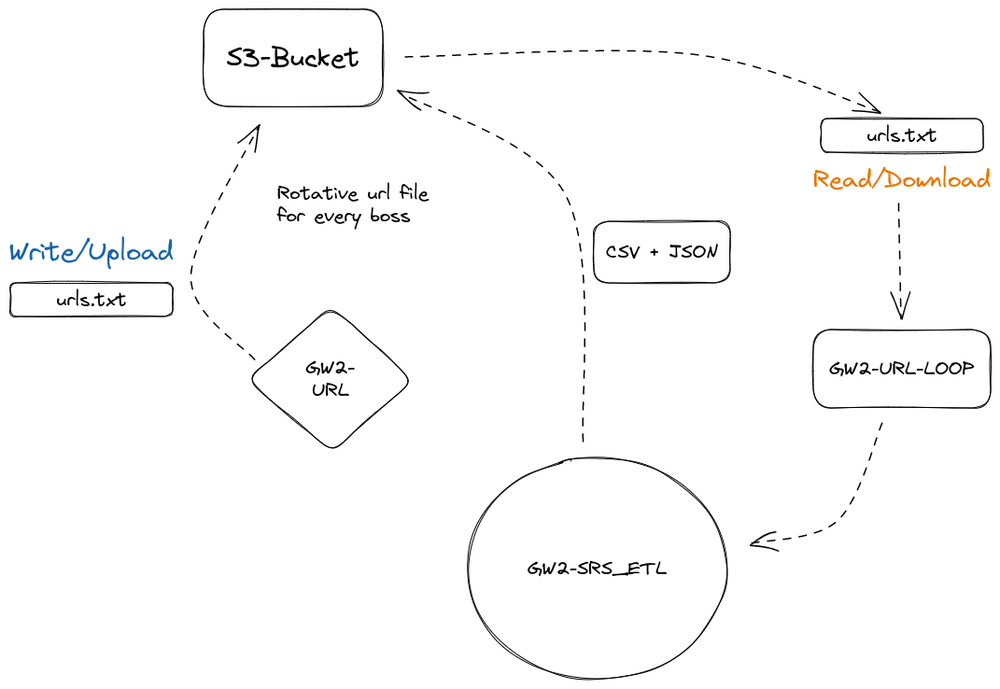
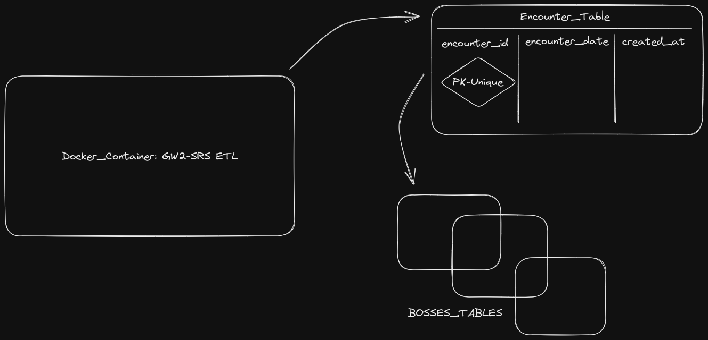

    <h1>GW2-SRS with AWS-S3 implementation<h1>

    
    
    

## Table of Contents :notebook_with_decorative_cover:
- [Table of Contents :notebook\_with\_decorative\_cover:](#table-of-contents-notebook_with_decorative_cover)
- [**Overview** :eyes:](#overview-eyes)
  - [**GW2-SRS ETL**](#gw2-srs-etl)
  - [**AWS S3**](#aws-s3)
  - [**Docker**](#docker)
  - [**Airflow**](#airflow)
  - [**Extra Information**](#extra-information)
- [Project Schema](#project-schema)

## **Overview** :eyes:
This repository is an improvement of the original GW2-SRS project that make use of AWS S3 to store data such as txt files of urls and csv and json files
from the ETL result. Apart from that, this project intention is also implement Docker as a container medium and Airflow to execute the ETL on monthly intervals (31 days).

### **GW2-SRS ETL**
This module have been kept quite the same as the original, just making some few changes to adapt to the new work environment and also to admit some new
features.

### **AWS S3**
Making use of a S3 bucket, it is intended to store some raw and clean data on it, so it can later pivot to other use cases such as AWS database with DynamoDB or RDBMS.

### **Docker**
The intention behind the use of Docker is make the ETL functional anywhere at anytime, by making a Docker container it will be possible to execute the ETL is other devices such as AWS EC2 machine.

### **Airflow**
To make the ETL a lot more functional it is intended to implement an scheduler, like Airflow in this case. By making Airflow execute the ETL monthly (about 31 days of wait per round) we will make sure the ETL keeps not only running but also adding new data.

### **Extra Information**
- This ETL is running in batch mode, no stream mode is being used since the data requires being stored first on a web.
- The ETL use Python logging to store all the errors or value information into a log file that keeps us updated of what is happening.

## Project Schema

